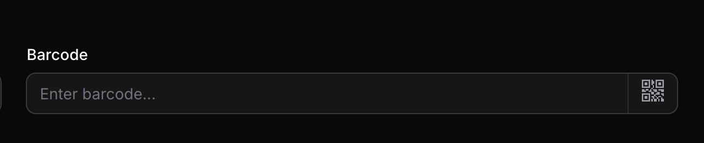

# Filament Barcode Scanner Field

[](https://packagist.org/packages/marcelorodrigo/filament-barcode-scanner-field)
[](https://github.com/marcelorodrigo/filament-barcode-scanner-field/actions?query=workflow%3Arun-tests+branch%3Amain)
[](https://github.com/marcelorodrigo/filament-barcode-scanner-field/actions?query=workflow%3A"Fix+PHP+code+styling"+branch%3Amain)
[](https://packagist.org/packages/marcelorodrigo/filament-barcode-scanner-field)

## Overview

A powerful barcode scanner input field for Filament applications. This package provides an intuitive interface that allows users to scan barcodes using their device's camera directly from your Filament forms. Built with [html5-qrcode](https://github.com/mebjas/html5-qrcode) for reliable cross-browser barcode scanning.

### Features

- **Modal Scanner Interface**: Opens a clean modal popup for barcode scanning without cluttering your forms
- **Real-time Camera Scanning**: Uses device camera to scan barcodes instantly
- **Customizable Icons**: Customize the input suffix icon with any Heroicon
- **Responsive Design**: Works seamlessly across desktop and mobile devices
- **Filament Native**: Extends Filament's TextInput with full form validation support
- **Livewire Integration**: Automatically updates form state when barcode is scanned
- **Filament v4 & v5 Compatible**: Works with both Filament versions

### Screenshot



*Barcode input field with scan button in dark mode*

## Installation

Install the package via Composer:

```bash
composer require marcelorodrigo/filament-barcode-scanner-field
```

The package will automatically register itself.

### Publishing Assets (Optional)

You can publish the config file with:

```bash
php artisan vendor:publish --tag="filament-barcode-scanner-field-config"
```

This is the contents of the published config file:

```php
return [
    // Configuration options can be added here in future versions
];
```

Optionally, you can publish the views using:

```bash
php artisan vendor:publish --tag="filament-barcode-scanner-field-views"
```

## Usage

Use the `BarcodeInput` component in your Filament forms:

```php
use Marcelorodrigo\FilamentBarcodeScannerField\Forms\Components\BarcodeInput;

public function form(Form $form): Form
{
    return $form
        ->schema([
            BarcodeInput::make('barcode')
                ->label('Product Barcode')
                ->required(),
        ]);
}
```

### Basic Example

```php
use Marcelorodrigo\FilamentBarcodeScannerField\Forms\Components\BarcodeInput;

// Simple usage
BarcodeInput::make('sku')
    ->label('SKU Code')
    ->placeholder('Scan or enter barcode...')
    ->required();
```

### With Custom Icon

```php
use Marcelorodrigo\FilamentBarcodeScannerField\Forms\Components\BarcodeInput;

// Customize with a different Heroicon
BarcodeInput::make('barcode')
    ->icon('heroicon-o-qr-code')
    ->label('Scan Product');
```

### Available Methods

| Method | Description | Default |
|--------|-------------|---------|
| `icon(string $icon)` | Set a custom [Heroicon](https://heroicons.com/) for the scan button | `heroicon-m-qr-code` |
| `label(string \| Htmlable \| null $label)` | Set the field label | `null` |
| `placeholder(string \| Htmlable \| null $placeholder)` | Set input placeholder | `"Enter {label}..."` |
| `required(bool \| string $condition = true)` | Make the field required | `false` |

### Standard Filament Methods

Since `BarcodeInput` extends `TextInput`, all standard Filament field methods are supported:

```php
BarcodeInput::make('barcode')
    ->icon('heroicon-o-arrow-right')
    ->label('Product Barcode')
    ->placeholder('Scan or type barcode...')
    ->required()
    ->unique('products', 'barcode')
    ->rules(['min:8', 'max:50'])
    ->helperText('Scan the barcode on the product packaging')
    ->hint('Required')
    ->live()
    ->afterStateUpdated(fn ($state) => $this->lookupProduct($state));
```

## Advanced Usage

### Customizing the Scanner Experience

The scanner uses the html5-qrcode library with default settings optimized for common barcodes:

- **FPS**: 10 frames per second for smooth scanning
- **QR Box**: 250x250px scanning area

### Handling Scan Results

The barcode value is automatically set to the form field when a barcode is successfully scanned. You can add Livewire event listeners to handle the scanned value:

```php
BarcodeInput::make('barcode')
    ->live()
    ->afterStateUpdated(function ($state, Set $set) {
        // Lookup product by barcode
        $product = Product::where('barcode', $state)->first();
        
        if ($product) {
            $set('product_name', $product->name);
            $set('price', $product->price);
        }
    });
```

### Form Validation with Scanned Barcodes

```php
use Filament\Forms\Components\TextInput;
use Filament\Forms\Components\Select;

public function form(Form $form): Form
{
    return $form
        ->schema([
            BarcodeInput::make('barcode')
                ->label('Product Barcode')
                ->required()
                ->rules(['exists:products,barcode'])
                ->validationMessages([
                    'exists' => 'Product with this barcode not found.',
                ]),
            
            TextInput::make('quantity')
                ->numeric()
                ->required()
                ->default(1),
        ]);
}
```

## Changelog

Please see [CHANGELOG](CHANGELOG.md) for more information on recent changes.

## Contributing

Please see [CONTRIBUTING](.github/CONTRIBUTING.md) for details.

### Requirements

- Follow [PSR-2 Coding Standard](https://github.com/php-fig/fig-standards/blob/master/accepted/PSR-2-coding-style-guide.md)
- Add tests for your changes
- Use [Conventional Commits](https://www.conventionalcommits.org/) for commit messages
- Document any behavioral changes

### Running Tests

```bash
composer test
```

## Security Vulnerabilities

Please review [our security policy](https://github.com/marcelorodrigo/filament-barcode-scanner-field/security) on how to report security vulnerabilities.

## Credits

- [Marcelo Wiebbelling](https://github.com/marcelorodrigo)
- [All Contributors](../../contributors)

## License

The MIT License (MIT). Please see [License File](LICENSE.md) for more information.
